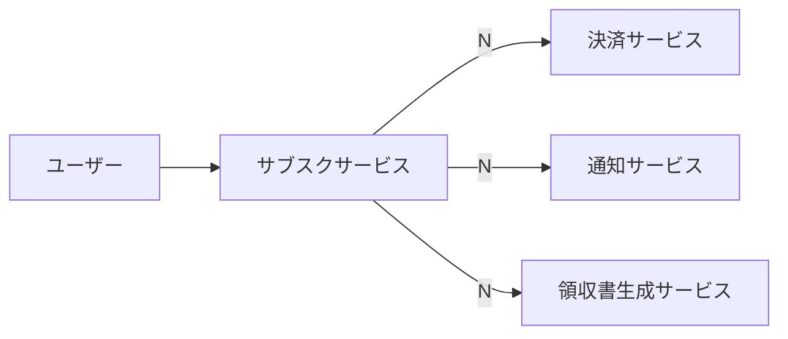
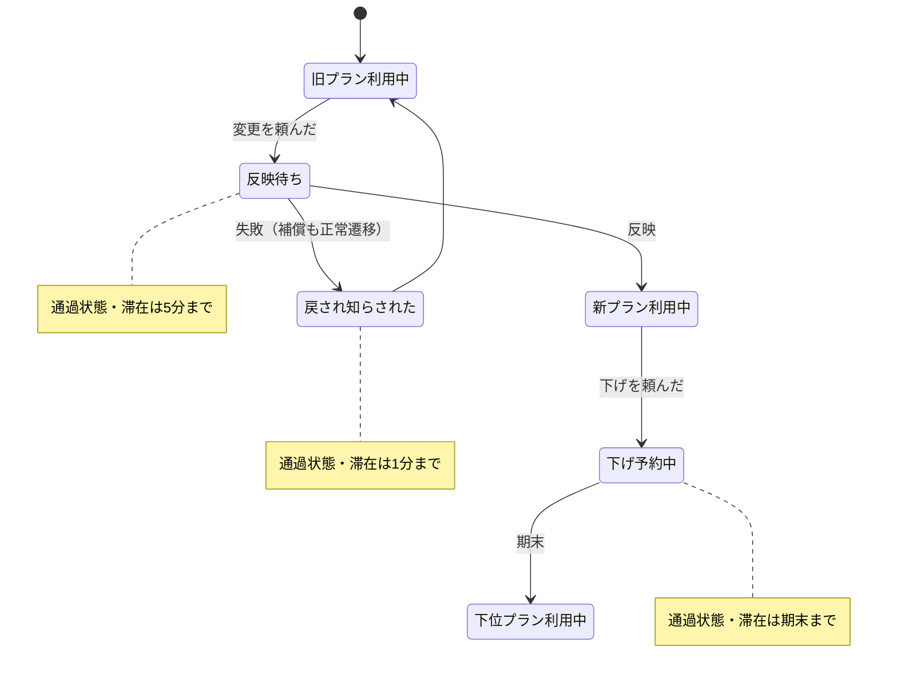

# ツジツマ設計（一枚版 v4）

## まず、一話「1,480円の話」

ある土曜の朝、動画配信サービスに問い合わせが一件入った。「今月、1,480円が二回引き落とされています。プランは一つしか契約していません」

調査が始まった。

決済チームが調べた。二件の課金はどちらも正規のリクエストに基づく正常な決済で、カード会社への請求処理も仕様どおり完了している。エラーは一件もない。「決済は正常です」

アプリチームが調べた。あの夜、プラン申込のAPIが一度タイムアウトし、クライアントは設計どおり自動でリトライしていた。リトライは障害時の標準動作で、実装はレビューを通っている。「アプリは正常です」

基盤チームが調べた。タイムアウトの原因は夜間バッチと重なった一時的な負荷で、想定の範囲内。SLAも満たしている。「基盤は正常です」

カスタマーサポートは規定どおり返金を起票し、1,480円は10営業日以内に返金された。「対応は正常です」

障害報告書の原因欄には「複合的要因」と書かれ、対策欄には「リトライ間隔の調整を検討」と書かれた。誰も嘘をついていない。全員が仕様どおりに働いた。ログには、エラーが一行もない。

ただ、ユーザーの通帳にだけ、身に覚えのない1,480円が記録されていた。

「一回の申込に、請求は一回」——この一行は、どのチームの仕様書にも書かれていなかった。書かれていないものは、破れたことにもならなかった。

---

**観点**：各部分がすべて正常に動いていても、全体としてユーザーへの約束が破れる経路は存在する。それをテストや障害対応ではなく、設計の最初に扱う。

成果物は三つだけ。①コンテクスト図、②ユーザーから見た状態遷移図、③約束リスト。順序は固定（①→②→③→④の一問）。新しい図法は作らず、既存の図に規約を足すだけで定義する。

---

## ① コンテクスト図 — 外部への線に一問だけ書く

普通に描く。ただし外部サービスへ引く線それぞれに一問だけ書き込む。

> **外部サービスの正常応答だけを証拠として、ユーザーが約束された結果をすでに得たと言い切れるか？ Y / N**

**すべての線に Y か N を表記する**（無印の線＝未判定であり、レビューで指摘する）。N の線の先で起きることの責任は、自分側に残る。

**規約**
- 外部への線は全て Y/N を判定し、**図に表記する**。無印を残さない
- **Y は例外的である**。相手の受付完了ではなく、**ユーザーへの約束の完了まで**相手が保証している場合に限る
- Y と書く線には**根拠を一言添える**：何をもってユーザーの受領まで観測できるとするか。根拠の書けない Y は N に落とす
- 同期応答は Y の根拠にならない。領収書生成サービスが PDF を同期で返しても、それは「自分と相手の間」の完了であって、ユーザーへ渡す途中の失敗は残る。約束は「自分とユーザーの間」にある——だから上図の領収書生成も **N**
- 実際に判定すると、ほぼ全ての線が N になる。**それ自体が発見である：外部委任によって自分の責任が消えることは、ほとんどない**
- N の線は、③のどこかに必ず対応する行を持つ。Y の線は③の突合が不要（通常のエラー処理で足りる）

---

## ② ユーザーから見た状態遷移 — 正常な遷移だけ描き切る

描く主体は**エンティティの status ではなく、ユーザーから見た状態**。「払った／受け取った」「頼んだ／反映された」「やめた／消えた」の粒度で描く。

状態は二種類に分類する。

- **定常状態**：期限なしで滞在可能
- **通過状態**：滞在期限の明記が必須

**規約**
- **期限を書けない通過状態は、設計未了の表示としてそのまま残す**
- 補償（失敗して元に戻り、知らされる）は例外系ではなく**正常遷移の一部**として描く
- **描かれていない状態は存在禁止**（例：二重に払った、旧料金で新機能）
- **通過状態に期限を超えて留まるのは滞留禁止**。存在禁止・滞留禁止のどちらも「破れ」として検知対象
- 表記：手描き・SVG では通過状態を点線の箱で描くことを推奨。mermaid では note で期限を示す

---

## ③ 約束リスト — 約束には、その破れを知る方法まで書く

三層で書く。

| 層 | 意味 | 規約 |
|---|---|---|
| **大項目** | 約束そのもの | ユーザーの言葉で書ける文。状態に言及しない。**5個以内**（超えたら具体に降りすぎ） |
| **中項目** | スコープ | 使える語は**「常時」か②の状態名そのもののみ**（「〜の間」等の変形も不可）。内部イベント（「失敗したとき」等）は不可——検査するのは出来事ではなく、ユーザーが最終的に置かれた状態 |
| **小項目** | 破れを知る方法 | **突合**（状態Aと状態Bの照合）か**経過**（滞留時間の監視）の二種のみ。行末に一言 |

### 例：サブスクのプラン変更

**大1　払った分と使えるものは、常に釣り合う**

| スコープ | 約束 | 破れを知る方法 |
|---|---|---|
| 旧プラン利用中 | 請求と権限が旧プランで一致する | 突合：請求×権限（日次・プラン別に同一ジョブ） |
| 新プラン利用中 | 請求と権限が新プランで一致する | 同上 |
| 下位プラン利用中 | 請求と権限が下位プランで一致する | 同上 |
| 反映待ち | 機能も請求も、旧プランで統一されている | 突合：期間内請求×反映時刻 |
| 戻され知らされた | 差額が残っていない | 突合：要求×結果×請求 |

**大2　操作の結果は、本人から見て一貫する**

| スコープ | 約束 | 破れを知る方法 |
|---|---|---|
| 常時 | 一回の変更に、請求の変化は一回だけ | 突合：変更ID×請求数 |
| 反映待ち | 画面に「反映中」であることが見えている | ⚠ 未定 — 破れを知る方法が未定（責任は残る） |
| 反映待ち | 5分を超えて続かない | 経過：滞留時間の監視 |
| 戻され知らされた | 戻った事実と通知が揃っている（黙って戻らない） | 突合：結果×通知 |
| 戻され知らされた | 1分を超えて続かない | 経過：滞留時間の監視 |
| 常時 | 発行を頼んだ領収書を本人が受け取れる | 突合：発行要求×生成結果×配信結果 |

**大3　下げたときは、期末までいまのまま**（事業判断としての約束）

| スコープ | 約束 | 破れを知る方法 |
|---|---|---|
| 下げ予約中 | 期末まで、上位機能がそのまま使える | 突合：変更予約×権限×期末日 |
| 下げ予約中 | 期末を過ぎて続かない | 経過：期末超過の監視 |

**規約**
- 通過状態一つにつき、**経過型の行が必ず一行**生える
- **複数の行が一つの実行物に畳まれてよい**（大1の状態別三行は、プラン別にパラメータ化した同一の突合で覆える）。対応は行→実行物の多対一を許す。実行物のない行だけが ⚠
- 破れを知る方法が書けない行は**赤字（⚠）のまま残す**。約束と責任はすでに存在している——**まだ運用に載っていないだけ**。未定のまま台帳に居座り続けること自体が、いつか実装させる圧力になる
- 技術的には不整合に見える状態も、②に許可された状態として描き、③で約束と検知を定義すれば**仕様**になる（大3）。破れと仕様の境界線は、三つの成果物が対応しているかで引かれる

---

## ④ レビューの一問

> **全員が正常なまま、処理が遅れたり、重なったり、繰り返されたとき、ユーザーに身に覚えのない状態が生まれる経路はどこか**

一問で、単発の破れ（順路の欠落）と多重成立の破れ（二重請求・二重予約・重複通知・古い結果による上書き）の両方を掃く。冒頭の一話は後者の型。

---

## 検算 — 三つの成果物は互いを監査する

| 方向 | 規則 | 破れたときの意味 |
|---|---|---|
| ①→③ | N の線は③に対応行を持つ | 外部委任の責任が未定義 |
| ②→③ | ②の各状態は、③に**同名のスコープを持つか、「常時」の行に明示的に包含される** | その状態の内側の約束が未定義 |
| ③→①② | ③で対応先を指せない行が出た | ①②の描き漏らし（図に戻る） |

どれか一つをサボると、他の二つに空欄が出る。この検算は書き手自身の文書にも走らせること（v1 は「戻され知らされた」が、v2 は「旧プラン利用中」等の定常状態が、v3 は領収書生成サービスの N に対応する約束が、検算で引っかかる状態だった）。

「常時」の包含を認めるのは手軽さのため。機械的に検算したい局面（実装との突き合わせを AI に分類させる等）では、「常時」を全状態へ展開した表を生成すればよい。**原本は包含、展開はビュー**。

---

## 入れないもの（意図的な範囲外）

- **性能・負荷容量**（スループット、キャパシティプランニング）— ただし**約束の多重成立**（重複・並行・遅延・逆順による破れ）は範囲内。④の一問が掃く
- **実現方式**（冪等キーの切り方、突合の実装手段）— 実装の自由を残すため一切書かない
- **⚠ の行の即時解決** — 赤字のまま運ぶ

## 運用

- 新しい儀式は作らない。**PR という既存の強制点に相乗りする**：「②の図を更新した／更新不要と判断した」のどちらかを必ず選ばせる。考えなかったことが記録に残る構造にする
- **文書だけで終わらせず、③の各行を実行物（突合ジョブ・滞留監視）と対応させる。継続実行によって、約束と実装のずれを観測可能にする**。実行物も仕様変更・スキーマ変更・常時ゼロ件化で劣化するため、突合自身の死活（生きている証拠を定期的に出すこと）は、いずれ突合自身への約束として同じ様式で書く——検知の検知
- 既存コードベースへの適用は、**コードを見ずに①②③を先に書く**。原本と実装の差分が監査結果。最初の突合で出土する既存の破れは、失敗ではなく監査の成功と事前に定義しておく
